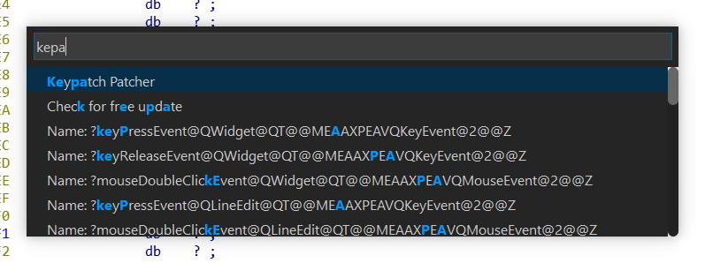
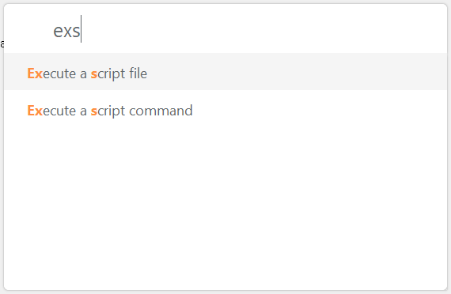

# IDA command palette & further

[](https://ci.appveyor.com/project/Jinmo/ifred)



## How to build

Currently tested on Windows. Install Qt 5.6.3 and IDA SDK, and follow steps in .appveyor.yml.

You can download [prebuilt plugins](https://ci.appveyor.com/project/Jinmo/ifred/build/artifacts) from appveyor.

## Python API

You can make a custom palette in IDAPython.

```py
from __palette__ import show_palette, Palette, Action
import random, string

myhandler = lambda item: sys.stdout.write('You selected: %s\n' % item.description)
random_str = lambda: "".join(random.choice(string.lowercase) for i in range(20))

entries = [Action(description=random_str(), # displayed text
    handler=myhandler, # callback
    id='action%d' % i # must be unique
    ) for i in range(20)]

show_palette(Palette('palette name here', entries))
```

## C++ API

Currently cleaning up C++ API. See `standalone/` folder.

```cpp
#include <widgets/palette_manager.h>
#define COUNT 100

QVector<Action> testItems() {
    QVector<Action> action_list;

    action_list.reserve(COUNT + 1);
    action_list.push_back(Action("std::runtime_error", "raise exception", ""));

    for (int i = 0; i < COUNT; i++) {
        auto id = QString::number(rand());
        action_list.push_back(Action(id, id, ""));
    }

    return action_list;
}

const QString TestPluginPath(const char* name) {
    // Don't worry! also packaged with bundle theme!
    // Just point a writable path
    return QString("./path_to_plugin_theme/") + name;
}

int main() {
    QApplication app(argc, argv);

    set_path_handler(TestPluginPath);

    show_palette("<test palette>", testItems(), [](const Action & action) {
        if (action.id() == "std::runtime_error") {
            throw std::runtime_error("raised!");
        }
        qDebug() << action.id() << action.description() << action.shortcut();
        return false;
    });

    app.exec();
}
```

## Changing theme

You can copy css, json files from `palette/res/theme/<name>/*` to `%APPDATA%/Hex-rays/IDA Pro/plugins/palette/theme/`, like the existing css, json files.

ayu white:

